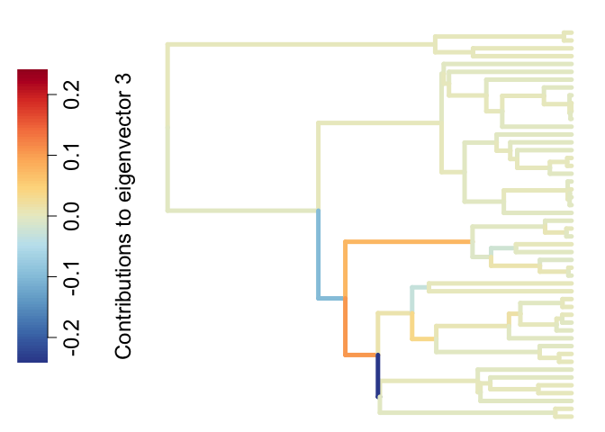
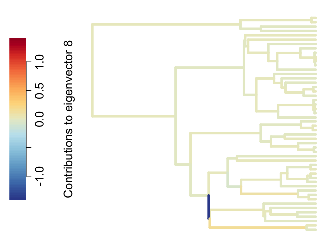

<!-- README.md is generated from README.Rmd. Please edit that file -->

# eiger

<!-- badges: start -->

[](https://github.com/applied-phylo-lab/eiger/actions/workflows/R-CMD-check.yaml)
<!-- badges: end -->

The goal of eiger is to incorporating eigenvectors of
variance-covariance matrices into phylogenetic analyses. Given a
phylogenetic tree, ‘eiger’ computes and visualizes the contributions of
the branches to the eigenvectors of some version of variance-covariance
matrix of the tree. If trait values are provided, ‘eiger’ can also run
phylogenetic generalized least squares with eigenvectors included as
fixed effects to investigate whether the traits are associated.

## Installation

You can install the development version of eiger from
[GitHub](https://github.com/) with:

``` r
# install.packages("devtools")
devtools::install_github("applied-phylo-lab/eiger")
```

## Example

This is a basic example which shows you how to compute the contributions
of the branches to the eigenvectors of a variance-covariance matrix of
the phylogenetic tree:

``` r
library(eiger)

set.seed(42)
yule_tree <- TreeSim::sim.bd.taxa(50, 1, 1, 0, 1, complete = FALSE)[[1]]
branch_contributions <- compute_branch_contributions(yule_tree, "vcv", 1:10)
utils::head(branch_contributions)
#>           dim_1         dim_2         dim_3         dim_4         dim_5
#> 1  5.997563e-01 -5.920484e-01 -2.705811e-03 -1.390093e-37 -2.372103e-03
#> 2 -4.655880e-01  6.055110e+00 -5.237515e+00 -2.421425e-35 -2.920915e-01
#> 3  1.713282e-02  1.910001e-01  5.455564e+00 -4.368296e-35 -4.708815e+00
#> 4 -2.506396e+00 -1.102826e+01 -1.270390e+01  1.747282e-33  1.895381e+02
#> 5 -1.167611e-02 -3.788404e-02 -1.746220e-02 -5.472827e-32 -7.444445e-01
#> 6 -1.986950e-15 -2.491013e-13  1.492051e-15  1.151638e-30  8.328758e-15
#>           dim_6         dim_7         dim_8         dim_9        dim_10
#> 1 -1.315503e-06 -5.691909e-04 -4.339885e-05 -3.035812e-04 -5.203486e-07
#> 2  1.124154e-05 -3.716735e-02  3.840075e-04 -1.808412e-02 -8.701055e-05
#> 3 -5.439658e-06  5.504310e-02 -6.433562e-04 -6.151502e-01  7.352728e-05
#> 4  1.651930e-04 -9.186165e+01 -4.907250e-02 -8.691762e+01  2.767092e-03
#> 5 -1.225677e-06  3.764676e+00  3.875468e-03  8.592365e+00  7.604388e-05
#> 6  2.104160e-13 -3.408082e-15 -1.678960e-14  4.248932e-14 -1.722425e-16
```

You can also plot the branch contributions:

``` r
plot_branch_contributions(yule_tree, branch_contributions, "vcv", 3)
```



Alternatively, you can compute and plot the contributions of the
branches to an eigenvector of a variance-covariance matrix of the
phylogenetic tree in one step:

``` r
plot_branch_contributions(yule_tree, cov_matrix = "dcvcv", dim = 8)
```



Another common issue to mitigate the confounding in phylogenetic
regressions. Given two quantitative traits and a phylogenetic tree, you
can first get the eigenvectors of the variance-covariance matrix for
convenience of downstream analyses:

``` r
BM <- phytools::fastBM(yule_tree, 1, nsim = 2)
x <- BM[, 1]
y <- BM[, 2]

df <- prepare_eiger(x, y, yule_tree, 20)
utils::head(df)
#>              X        Y    eigen_1    eigen_2     eigen_3       eigen_4
#> t48  0.5059172 7.960040 -0.1576493 -0.1515420  0.00842073  0.000000e+00
#> t49  2.3404129 6.848499 -0.1447424  0.1734111  0.18673123  8.348522e-17
#> t11  2.4644374 7.064110 -0.1609621 -0.1642439  0.01000946 -9.060398e-19
#> t28  1.0119205 6.579663 -0.1344856  0.1275235  0.08691925 -1.780920e-17
#> t18  1.2161309 3.357931 -0.1350099  0.1254461  0.06078392 -3.004505e-16
#> t34 -2.1840856 3.065954 -0.1362000  0.1246287 -0.29848002  1.012814e-16
#>          eigen_5       eigen_6       eigen_7      eigen_8      eigen_9
#> t48 -0.006638794 -1.364881e-01  0.0002481392 -0.188593425 -0.008644393
#> t49 -0.205940030 -6.340932e-05 -0.2114313538 -0.006001149  0.078276000
#> t11 -0.009714741 -2.240949e-01 -0.0114187533  0.347526123  0.008109300
#> t28  0.000502537  1.154914e-05  0.1190882974  0.001914110 -0.005824561
#> t18  0.353855732  6.495563e-04 -0.1132047733  0.002073595 -0.072131348
#> t34 -0.052243903  1.433370e-04 -0.0171612601  0.001118717 -0.011806248
#>          eigen_10     eigen_11      eigen_12      eigen_13      eigen_14
#> t48  8.404026e-05  0.001156725  0.000000e+00 -0.0235648279 -1.355746e-15
#> t49  3.842707e-04  0.062270044 -1.723674e-16 -0.0005525067 -3.260197e-15
#> t11  1.880178e-04  0.005681800  1.746150e-16  0.0809234201  5.696434e-18
#> t28 -2.731296e-03 -0.664349789  2.864482e-17  0.0338816063  7.071068e-01
#> t18  4.784140e-04  0.027755598  1.213970e-16  0.0020462378  5.998922e-16
#> t34 -4.596556e-01  0.013506168  3.094136e-17  0.0062976752 -1.484060e-15
#>          eigen_15      eigen_16      eigen_17      eigen_18      eigen_19
#> t48 -8.384803e-05 -2.052709e-03  0.0006607983  1.256635e-02 -0.0009196286
#> t49 -9.288782e-04  2.283960e-05 -0.0041245013 -9.043706e-05  0.3870287195
#> t11  5.030772e-05  9.676061e-04 -0.0002290090 -4.069880e-03  0.0001597642
#> t28 -8.900269e-03  1.632160e-04 -0.0193573800 -3.805087e-04  0.0179486581
#> t18  2.552324e-03 -1.310623e-04  0.4497352112 -3.376153e-03  0.0044232710
#> t34 -9.993930e-02 -1.351993e-05 -0.0007508911 -7.322899e-05  0.0002587387
#>          eigen_20      eigen_21      eigen_22     eigen_23      eigen_24
#> t48  0.6659904656  0.000000e+00  2.869307e-05 2.905306e-01 -1.400807e-05
#> t49  0.0004992695 -7.010785e-16 -7.890428e-07 2.431643e-05  4.555831e-05
#> t11 -0.0735864036  4.837322e-17  3.423444e-06 1.219747e-01 -5.546912e-05
#> t28 -0.0014399690  6.140968e-16  8.886810e-05 7.515292e-04  7.400968e-04
#> t18 -0.0015298102  1.279693e-14  6.627504e-01 7.299183e-04  4.204466e-01
#> t34 -0.0003962753 -1.416720e-16  8.425499e-06 2.410067e-04  7.494766e-05
#>          eigen_25      eigen_26      eigen_27      eigen_28      eigen_29
#> t48  2.695135e-03  4.715804e-04  6.071306e-01 -1.818678e-02 -2.023264e-15
#> t49  2.271916e-05  8.821551e-02 -3.525275e-06 -2.757737e-07 -1.060738e-15
#> t11 -6.810190e-04 -4.840416e-05 -7.773915e-05 -7.816546e-05  2.457898e-15
#> t28  1.260561e-04  2.338947e-02  8.423319e-06 -1.933030e-05 -8.417428e-18
#> t18  7.430312e-05  3.502258e-03  5.812604e-06 -1.217517e-05 -2.700167e-16
#> t34  4.309018e-05  6.602096e-04  3.624370e-06 -8.883015e-06 -1.569077e-15
#>         eigen_30      eigen_31      eigen_32      eigen_33      eigen_34
#> t48 0.0029856609 -1.279757e-04 -0.0001148284 -1.706946e-04 -1.606653e-15
#> t49 0.0000207572 -6.830201e-05 -0.0013123186 -7.871307e-05 -1.164126e-14
#> t11 0.0005029798 -2.161668e-05 -0.0000206019 -3.436983e-05  5.703755e-16
#> t28 0.0002403664 -7.880746e-04 -0.0056905542 -7.622206e-04 -2.815753e-15
#> t18 0.0001484031 -4.863966e-04 -0.0009634503 -4.766931e-04 -6.609680e-16
#> t34 0.0004163048 -1.502951e-02 -0.0004660181 -3.897968e-01 -1.319755e-12
#>          eigen_35     eigen_36      eigen_37      eigen_38      eigen_39
#> t48 -1.299178e-02 1.216825e-05  4.840016e-16  5.445623e-16 -2.524886e-15
#> t49 -6.380518e-06 3.992003e-01 -8.818079e-14  2.328415e-15  7.071068e-01
#> t11 -4.875492e-04 3.372355e-06 -3.890906e-15 -1.415529e-14 -1.577589e-14
#> t28 -5.172329e-05 5.596833e-04 -7.837925e-16 -8.659846e-16  3.763391e-16
#> t18 -3.234887e-05 1.013960e-04 -3.662872e-16 -1.207671e-15  6.371543e-15
#> t34  1.989161e-06 1.395643e-05  4.690661e-16  2.166041e-15 -5.799276e-15
#>          eigen_40      eigen_41      eigen_42      eigen_43      eigen_44
#> t48  3.373357e-16  0.000000e+00  2.881190e-18 -6.831276e-04 -3.838047e-16
#> t49 -7.899618e-13  7.177847e-15 -4.669840e-15 -2.412725e-06 -1.398056e-14
#> t11  4.269110e-15 -1.310677e-14 -2.636631e-14 -2.773725e-01 -4.358117e-14
#> t28 -2.370680e-16  9.060776e-17 -3.496109e-16 -2.060583e-05  8.357814e-16
#> t18  1.221523e-15  1.507503e-16 -3.187596e-16 -1.306013e-05  8.947196e-16
#> t34  8.805111e-15  8.500471e-15 -7.071068e-01 -7.001184e-06  9.186085e-14
#>          eigen_45      eigen_46      eigen_47      eigen_48      eigen_49
#> t48 -4.385472e-17 -7.572518e-05  1.444138e-05 -4.712675e-16 -1.210097e-05
#> t49  2.530610e-15 -8.732756e-07  5.549599e-08  5.279944e-14 -1.439044e-07
#> t11 -2.384698e-14 -1.095101e-05 -8.196974e-01  7.288858e-13 -3.042837e-06
#> t28  2.379527e-16 -7.102007e-06  4.454678e-07  7.587749e-16 -1.140963e-06
#> t18 -1.043045e-16 -4.509159e-06  2.829871e-07 -1.867705e-15 -7.252017e-07
#> t34  1.528798e-14 -2.483197e-06  1.570132e-07  2.908464e-14 -4.052644e-07
#>          eigen_50
#> t48  3.170004e-16
#> t49 -2.406508e-14
#> t11 -8.584455e-14
#> t28  1.114404e-15
#> t18 -3.904468e-16
#> t34 -4.179335e-15
```

Then you can run eiger regression (phylolm with eigenvectors of the
variance-covariance matrix as fixed effects):

``` r
run_eiger(x, y, yule_tree, 20, df = df)
#> Call:
#> phylolm::phylolm(formula = reg_formula, data = df, phy = tree)
#> 
#>    AIC logLik 
#> 122.57 -38.28 
#> 
#> Parameter estimate(s) using ML:
#> sigma2: 0.3873585 
#> 
#> Coefficients:
#>  (Intercept)            X      eigen_1      eigen_2      eigen_3      eigen_4 
#>  -70.7508706    0.1097984 -516.1221221   28.6089632   -6.9693645  133.9414754 
#>      eigen_5      eigen_6      eigen_7      eigen_8      eigen_9     eigen_10 
#>    5.9160672   -2.2098423    4.0636454   -2.0317750    3.2329012    1.3908234 
#>     eigen_11     eigen_12     eigen_13     eigen_14     eigen_15     eigen_16 
#>   -6.2229469  -10.0293783   -3.7525465    0.4010527    3.0584358    0.1024626 
#>     eigen_17     eigen_18     eigen_19     eigen_20 
#>    0.2997828    1.9634039    1.5420587    0.7518774
```

Alternatively, you can compute the eigenvectors and run eiger regression
in one step:

``` r
run_eiger(x, y, yule_tree, 30)
#> Call:
#> phylolm::phylolm(formula = reg_formula, data = df, phy = tree)
#> 
#>    AIC logLik 
#> 131.81 -32.91 
#> 
#> Parameter estimate(s) using ML:
#> sigma2: 0.3123935 
#> 
#> Coefficients:
#>  (Intercept)            X      eigen_1      eigen_2      eigen_3      eigen_4 
#>  41.60120742   0.13076109 243.86041859 -23.82713774   4.51857322 -90.71404236 
#>      eigen_5      eigen_6      eigen_7      eigen_8      eigen_9     eigen_10 
#>  -7.99290734  -1.94580464  -3.60781165  -0.85319660  -2.35654129   1.61123302 
#>     eigen_11     eigen_12     eigen_13     eigen_14     eigen_15     eigen_16 
#>  -0.36518067  -0.55599456   2.84144694   0.44044312   1.71120187   0.13306831 
#>     eigen_17     eigen_18     eigen_19     eigen_20     eigen_21     eigen_22 
#>  -0.70493596   1.80444593   1.78527914   0.06556509  -0.95606472  -0.43365771 
#>     eigen_23     eigen_24     eigen_25     eigen_26     eigen_27     eigen_28 
#>   0.05399031   0.20354970  -0.10939309   1.43038338   0.93074007  -0.39278312 
#>     eigen_29     eigen_30 
#>  -0.37959140  -0.11687517
```
